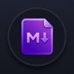

# MD3 Markdown Viewer テスト用サンプル

このドキュメントは、拡張機能 **MD3 Markdown Viewer** の機能、デザイン、およびパフォーマンスを確認するためのテスト用マークダウンファイルです。

---

## 1. タイポグラフィと見出し階層

見出し階層が左側の目次（TOC）に正しく反映され、折りたたみトグルが機能することを確認してください。

### 1.1. 階層のネストテスト (H3レベル)
H3見出しはH2見出しの子要素として目次にインデントされて表示され、H2部分で折りたたむことができます。

#### 1.1.1. 深い階層 (H4レベル)
※ 今回の目次は設計書に基づき `h1, h2, h3` までを抽出対象としていますが、本文内のH4以下のスタイルが崩れていないかもここで確認できます。

---

## 2. コードブロック

コードブロックには右上に「Copy」ボタンが表示され、ワンクリックでクリップボードへコピー可能です。また、等幅フォント（JetBrains Mono 等）が綺麗に適用されているか確認してください。

### 2.1. JavaScript の例
```javascript
// フィボナッチ数の計算
function fibonacci(n) {
  if (n <= 1) return n;
  return fibonacci(n - 1) + fibonacci(n - 2);
}

console.log(`フィボナッチ数 (10): ${fibonacci(10)}`);
```

### 2.2. CSS の例
```css
:root {
  --primary-color: #d0bcff;
  --transition-smooth: all 0.3s cubic-bezier(0.2, 0, 0, 1);
}

.markdown-body pre:hover .code-copy-button {
  opacity: 1;
  transform: translateY(0);
}
```

---

## 3. リストと装飾

多様なリスト表現と、インラインの文字装飾のテストです。

### 3.1. リスト各種

*   **箇条書きリスト（アンオーダード）**
    *   第2階層の項目
        *   第3階層の項目（ネスト表現）
    *   別の項目
*   **番号付きリスト（オーダード）**
    1.  最初のステップ
    2.  次のステップ
        1.  サブステップ 1
        2.  サブステップ 2
    3.  最後のステップ

### 3.2. タスクリスト
- [x] MD3 3カラム/2カラムレイアウトの構築
- [x] 目次の木構造化と折りたたみ機能の追加
- [ ] スクロールスパイの微調整
- [ ] 拡張機能ストアへの申請準備

### 3.3. 文字装飾（インライン）
- **太字 (Bold)** : `**太字**` または `__太字__`
- *斜体 (Italic)* : `*斜体*` または `_斜体_`
- ~~打ち消し線 (Strikethrough)~~ : `~~打ち消し線~~`
- `インラインコード (Inline Code)` : `` `インラインコード` ``
- [Googleへのリンク](https://www.google.com)

---

## 4. 引用とテーブル

### 4.1. 引用ブロック (Blockquote)
MD3 の左ボーダー線とソフトな背景色が適用されていることを確認します。

> **Material Design 3 (M3)** は、Google のオープンソース・デザインシステムの最新版です。
> パーソナライズ、表現力、適応性を重視し、ダイナミックカラーなどの新機能を提供します。
>
> 複数行の引用もこのように見やすくマージンが確保されます。

### 4.2. 表 (Table)
ヘッダー背景色、境界線、偶数行の背景トーン（ストライプ）を確認します。

| プロジェクト名 | 言語 / 技術 | バージョン | 進捗状況 |
| :--- | :---: | :---: | :---: |
| **chrome-md3-markdown-viewer** | JavaScript / CSS | MV3 | 開発中 |
| **chrome-md3-index-viewer** | JavaScript / CSS | MV3 | リリース済 |
| **sample-docs** | Markdown | N/A | 完了 |

---

## 5. 画像とメディア

標準の画像タグのスタイルや角丸、影（ドロップシャドウ）のテストです。

### 5.1. テスト画像
以下は、拡張機能用に生成したアプリアイコン画像です（ローカル相対パスでの表示確認用）。


